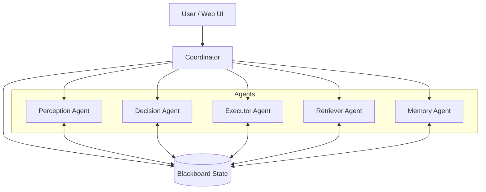

# System Architecture

## 1. High-Level Design: The Blackboard Pattern

The core of this project is built upon the **Blackboard Architecture**. Unlike a traditional linear chain of thought, this system uses a central, shared repository of state called the **Blackboard**. Agents do not communicate directly with each other; instead, they read from and write to this shared state.

### Key Components
*   **Blackboard (`agent_state.py`)**: The central data store containing the conversation history, current plan, context data (memory/docs), user feedback, and execution results.
*   **Coordinator (`coordinator.py`)**: The controller that manages the lifecycle of a user request. It invokes agents in a specific order but relies on the Blackboard to maintain continuity.

---

## 2. Multi-Agent Roles

Each agent is a specialized worker with a specific responsibility.

### 🧠 Perception Agent (`agents/perception_agent.py`)
*   **Role**: The "Sense" mechanism. It interprets the state of the world.
*   **Input**: User query, Tool outputs, Execution results.
*   **Output**: A structured "Snapshot" of the current state.
*   **Function**: Determines if the user's goal has been achieved, summarizes tool outputs into natural language, and identifies if the system needs to consult external knowledge (Ground Truth).

### 🧭 Decision Agent (`agents/decision_agent.py`)
*   **Role**: The "Brain". It handles planning and reasoning.
*   **Input**: The Blackboard state (History, Context, Feedback).
*   **Output**: A single, actionable **Step**.
*   **Function**:
    *   **Initial Planning**: Decomposes a complex user query into a logical sequence of steps.
    *   **Replanning**: Dynamically adjusts the plan based on new information (e.g., a tool failure or user feedback).
    *   **Next Step**: Selects the immediate next action to perform.

### 🛠️ Executor Agent (`agents/executor_agent.py`)
*   **Role**: The "Hands". It interacts with the outside world.
*   **Input**: A planned Step (containing Code or Tool Calls).
*   **Output**: Execution Result (String, JSON, or Error).
*   **Function**:
    *   Executes Python code in a sandboxed environment.
    *   Calls MCP Tools (Web Search, RAG, etc.).
    *   Handles errors and timeouts safely.

### 🔍 Retriever Agent (`agents/retriever_agent.py`)
*   **Role**: The "Librarian". It fetches context before planning begins.
*   **Input**: User Query.
*   **Output**: Relevant chunks of text from documents or memory.
*   **Function**:
    *   Queries the Vector Database (FAISS) for relevant document chunks.
    *   Retrieves past conversation history relevant to the current topic.

### 💾 Memory Agent (`agents/memory_agent.py`)
*   **Role**: The "Scribe". It manages the storage and retrieval of memories.
*   **Function**:
    *   Initializes session memory.
    *   Commits successful interactions to long-term storage.
    *   Manages the lifecycle of the FAISS indices.

---

## 3. Memory Architecture

The system implements a **Tiered Memory System** to balance immediate context with long-term recall.

### Tier 1: Session Memory (Short-Term)
*   **Storage**: JSON files (`memory/session_<id>.json`).
*   **Scope**: The current active conversation session.
*   **Content**: Full conversation history, user preferences defined in the current session, and immediate context.
*   **Usage**: Used by the Decision Agent to maintain conversation flow and handle follow-up questions.

### Tier 2: Conversation Memory (Long-Term / Episodic)
*   **Storage**: FAISS Vector Database (`mcp_servers/faiss_index/`).
*   **Scope**: Across all sessions.
*   **Content**: Summaries of successful past interactions, user facts (e.g., "User lives in New York"), and learned preferences.
*   **Mechanism**:
    *   When a task is successfully completed, the Q&A pair is embedded and stored.
    *   On a new query, the Retriever Agent searches this index for semantically similar past experiences.

### Tier 3: Document Memory (Semantic / RAG)
*   **Storage**: FAISS Vector Database (separate index).
*   **Scope**: Static knowledge base.
*   **Content**: Uploaded documents (PDFs, TXTs) indexed for Retrieval Augmented Generation (RAG).
*   **Usage**: Provides "Ground Truth" knowledge for answering factual questions based on specific files.

---

## 4. Human-in-the-Loop (HITL) Workflow

The system is designed to be semi-autonomous, allowing human intervention at critical junctures. This is controlled via the `hitl_config` dictionary in the Blackboard.

### Control Points

1.  **Plan Approval**
    *   **Trigger**: After the Decision Agent generates an Initial Plan.
    *   **Interaction**: The system pauses and presents the full plan to the user.
    *   **User Action**:
        *   **Approve**: Execution proceeds.
        *   **Reject/Feedback**: User provides text feedback (e.g., "Don't use web search, use local docs"). The Decision Agent receives this feedback and **Replans**.

2.  **Step Approval**
    *   **Trigger**: Before the Executor Agent runs any step.
    *   **Interaction**: The system shows the specific code or tool call about to be executed.
    *   **User Action**:
        *   **Approve**: Step executes.
        *   **Skip**: The step is marked as skipped, and the agent moves to the next step.
        *   **Stop**: The entire execution is aborted.

3.  **Dynamic Feedback (ASK_USER)**
    *   **Trigger**: The Agent explicitly generates a step of type `ASK_USER`.
    *   **Scenario**: The agent is stuck, needs clarification, or requires missing information (e.g., "What is the password?").
    *   **Interaction**: The system prompts the user for input, which is then injected into the Blackboard as a tool result.

---

## 5. Test Simulation Framework

To ensure reliability, the project includes a robust **Simulator** (`simulator/`) for batch testing.

### Workflow
1.  **Test Definition**: Tests are defined in `simulator/test_cases.json` with categories (Math, Memory, Web Search, etc.).
2.  **Execution**: `simulator/run_tests.py` iterates through the test cases.
    *   It spins up a fresh Coordinator for each test.
    *   It disables HITL for automation.
    *   It captures the final "Conclusion" from the agent.
3.  **Verification**: The result is compared against expected outcomes (currently manual/heuristic verification or simply logging for review).
4.  **Reporting**:
    *   **JSON History**: Results are saved to `simulator/test_history.json`.
    *   **HTML Reports**: `simulator/report_generator.py` compiles the JSON history into readable HTML dashboards (`report_details.html`, `report_stats.html`) showing pass rates, latency, and tool usage statistics.
