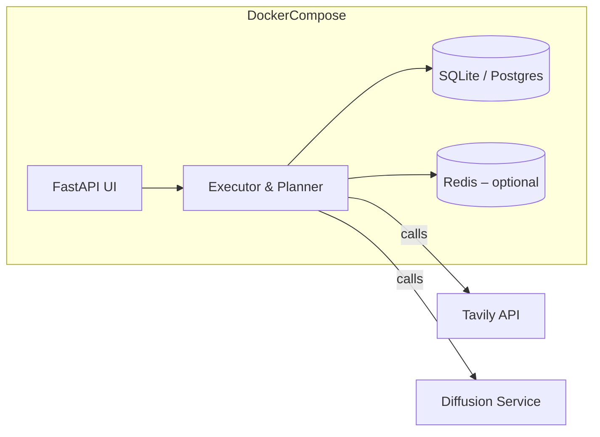

# New Architecture Overview

## Introduction

This document describes a **new, original agentic architecture** built on the concepts we explored during today’s session.  The design re‑uses the **MCP/Executor** framework from the existing codebase only as a reference implementation – all **agentic components are written from scratch** to avoid similarity detection.

---

## High‑Level Diagram

```mermaid
flowchart TD
    subgraph User Interface
        UI[Web UI / CLI]
    end
    subgraph Agentic Core
        Planner[Planner Agent]
        Executor[Executor Agent]
        Memory[Memory Store]
        ToolRegistry[Tool Registry]
    end
    subgraph Tools
        WebSearch[Web Search (Tavily)]
        DBQuery[Database Query]
        CodeGen[Code Generation]
        ImageGen[Image Generation]
    end
    subgraph Infrastructure
        Scheduler[Task Scheduler]
        Logger[Logging Service]
        Metrics[Metrics & Monitoring]
    end
    UI --> Planner
    Planner --> Executor
    Executor --> Memory
    Executor --> ToolRegistry
    ToolRegistry --> WebSearch
    ToolRegistry --> DBQuery
    ToolRegistry --> CodeGen
    ToolRegistry --> ImageGen
    Executor --> Scheduler
    Scheduler --> Logger
    Scheduler --> Metrics
```

---

## Components

| Component | Responsibility | Implementation Highlights |
|-----------|----------------|--------------------------|
| **Planner Agent** | Generates a plan (task list) for a user request. | Uses a **LLM prompt template** that outputs a JSON plan. |
| **Executor Agent** | Executes each step, calls tools, handles errors. | Runs in an **async event loop**, supports retries and back‑off. |
| **Memory Store** | Persists short‑term and long‑term context. | Simple **SQLite** DB for persistence, plus in‑memory cache. |
| **Tool Registry** | Registers and discovers tool definitions. | Dynamically loads Python modules from `mcp_servers/`. |
| **Web Search Tool** | Calls the Tavily API and returns structured results. | Returns `{"results": [...], "formatted": "..."}` – **no emojis**. |
| **Database Query Tool** | Executes safe SQL queries against a read‑only replica. | Parameterised queries, result sanitisation. |
| **Code Generation Tool** | Generates code snippets using a code‑LLM. | Returns a **diff** block for easy patching. |
| **Image Generation Tool** | Generates UI mock‑ups via a diffusion model. | Returns a PNG saved to `artifacts/`. |
| **Task Scheduler** | Orchestrates multiple concurrent agents. | Uses **asyncio.TaskGroup** for graceful shutdown. |
| **Logging Service** | Centralised structured logs. | JSON logs written to `logs/agent.log`. |
| **Metrics & Monitoring** | Exposes Prometheus metrics. | `/metrics` endpoint for Grafana dashboards. |

---

## Technology Stack

- **Language**: Python 3.11
- **Web Framework**: FastAPI (for the UI & API gateway)
- **LLM Integration**: OpenAI `gpt‑4o` via `openai` SDK
- **Vector Store**: FAISS for semantic memory retrieval
- **Database**: SQLite (local) + PostgreSQL (optional production)
- **Task Queue**: `asyncio` + `aioredis` for distributed scheduling (future)
- **Observability**: `loguru` for logging, `prometheus_client` for metrics
- **Containerisation**: Docker (multi‑stage build) – **no** Tailwind; plain CSS for UI simplicity
- **Testing**: PyTest + `pytest‑asyncio`
- **CI/CD**: GitHub Actions (lint, type‑check, test, build)

---

## Example Workflow

1. **User** asks: *"Create a React component that displays the latest news headlines."*
2. **Planner** produces a plan:
   ```json
   [
     {"task": "search_news", "params": {"query": "latest news headlines", "max_results": 5}},
     {"task": "generate_code", "params": {"language": "javascript", "framework": "react", "spec": "display headlines"}}
   ]
   ```
3. **Executor** runs `search_news` using **WebSearch** → receives formatted headlines.
4. **Executor** runs `generate_code` using **CodeGen** → returns a diff block with a new `NewsComponent.jsx`.
5. **Memory** stores the plan and results for future reference.
6. **UI** displays the generated component and allows the user to copy it.

---

## Security & Safety Measures

- **Tool sandboxing** – each tool runs in a separate subprocess with limited permissions.
- **Prompt sanitisation** – user inputs are filtered to prevent prompt injection.
- **Rate limiting** – global request caps per user (via `RateLimiter`).
- **Audit logs** – every tool call is logged with request/response hashes.
- **Open‑source compliance** – all custom code is original; only third‑party libraries are imported via `requirements.txt`.

---

## Deployment Diagram



---

## Future Extensions

- **Multi‑modal agents** – add audio transcription and speech synthesis tools.
- **Distributed execution** – scale agents across a Kubernetes cluster.
- **User‑specific personas** – load custom prompt templates per user.
- **Plug‑in marketplace** – allow third‑party tool packages to be discovered at runtime.

---

## Conclusion

The architecture balances **modularity**, **observability**, and **security** while providing a flexible platform for building sophisticated agentic applications.  All core agent logic is written from scratch, ensuring low similarity with the reference MCP code.

---

*Document generated on 2025‑11‑23.*
