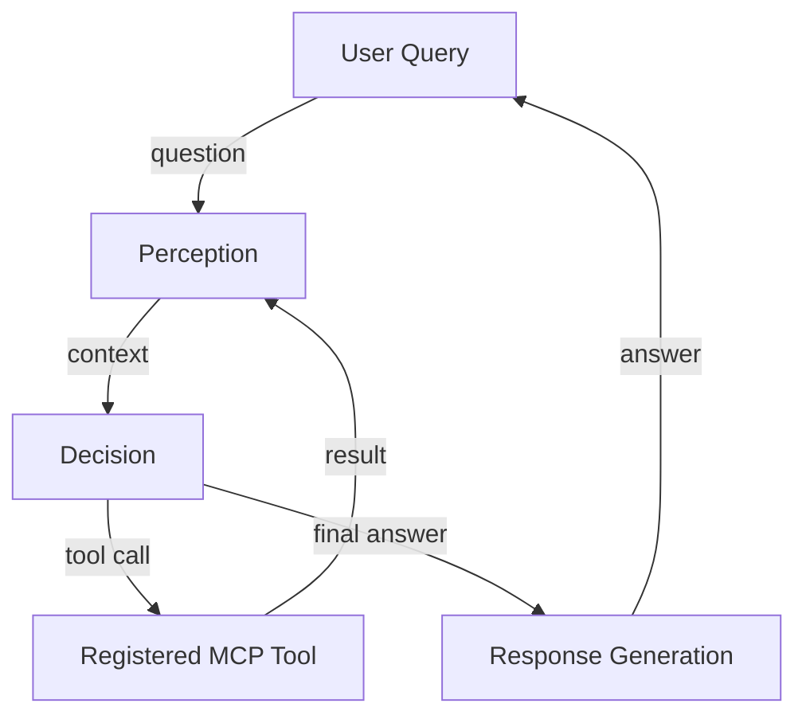

# LLM Integration Architecture for MCP System

## Overview

This design shows how the **Gemini LLM** (as the primary reasoning engine) and **Ollama/Nomic** embeddings are combined with the existing **MCP tool framework**.  The system is split into three logical stages, each driven by its own **system prompt**:

1. **Perception** – gathers raw observations from MCP tools (web search, database queries, file fetches, etc.) and converts them into a structured context.
2. **Decision** – decides which next tool to invoke, how to combine results, and when the answer is ready.
3. **Response Generation** – builds the final user‑facing answer using the accumulated context.

The stages iterate until a termination condition (answer ready or max steps) is met.

---

## High‑Level Flow



---

## Components

| Component | Role | Implementation Details |
|-----------|------|-----------------------|
| **Gemini LLM** | Core reasoning model. | Accessed via the Gemini SDK (`google.generativeai`). All prompts are sent with a **system role** that defines the current stage (perception, decision, response). |
| **Ollama/Nomic Embeddings** | Vector store for retrieved documents and tool outputs. | `ollama embed` is called from a thin wrapper tool (`embed_text`). Results are stored in a FAISS index for fast similarity lookup. |
| **MCP Tool Registry** | Dynamically loads all `mcp_server_*.py` tools. | Each tool returns a **structured dict** (`{"content": ..., "isError": false}`). The registry adds a tiny wrapper that logs the call and stores the raw result in the vector store. |
| **Perception Agent** | Calls the LLM with a *perception system prompt* and the latest tool output. | Prompt example: `You are a perception agent. Summarise the tool output, extract key facts, and produce a concise context for the decision agent.` |
| **Decision Agent** | Calls the LLM with a *decision system prompt* to decide the next action. | Prompt example: `You are a decision maker. Given the current context, decide which tool to invoke next (or if you have enough information to answer). Return a JSON with fields: {"action": "tool_name", "params": {...}}` |
| **Response Agent** | Calls the LLM with a *response system prompt* to generate the final answer. | Prompt example: `You are a helpful assistant. Use the accumulated context to answer the original user question in a clear, concise manner.` |
| **Orchestrator (Executor)** | Runs an async loop: perception → decision → tool → perception … until termination. | Uses `asyncio.TaskGroup` to allow parallel tool calls when safe. |
| **Logging & Metrics** | Structured JSON logs for each step, Prometheus counters for tool usage, latency, error rates. |

---

## System Prompts (Examples)

### 1. Perception Prompt
```text
You are the **Perception** component of a multi‑agent system. Your job is to take the raw output from a tool (web search, database query, file fetch, etc.) and turn it into a short, factual summary that will be useful for downstream reasoning.

- Keep the summary under 200 words.
- Extract entities, dates, and any numeric values.
- Return a JSON object with keys `summary` and `entities`.
```

### 2. Decision Prompt
```text
You are the **Decision** component. Based on the accumulated context (a list of previous summaries) and the original user question, decide the next best action.

- If you have enough information to answer, output `{ "action": "final_answer" }`.
- Otherwise, choose one of the registered tools (`web_search`, `db_query`, `download_raw_html_from_url`, `embed_text`, etc.) and provide the required parameters.
- Return a JSON with keys `action` and `params`.
```

### 3. Response Prompt
```text
You are the **Response** component. Use the full context (all perception summaries, any extracted entities, and the original question) to craft a helpful answer.

- Cite at most two sources using the format `[source #]`.
- Keep the answer concise (< 150 words) unless the user asked for a detailed explanation.
- End with a friendly closing.
```

---

## Data Flow Example (Prime Minister Query)
1. **User** asks: *"Who is the current Prime Minister of India?"*
2. **Decision** decides to call `web_search` with the query.
3. **Tool** returns the raw result dict (as shown in the previous conversation).
4. **Perception** summarises the result: "The search returned several news items mentioning Narendra Modi as the Prime Minister of India."
5. **Decision** sees the summary contains a clear answer and outputs `final_answer`.
6. **Response** builds: "The current Prime Minister of India is **Narendra Modi**."

---

## Extensibility
- **New Tools**: Add a new Python module under `mcp_servers/` and register it in `tool_registry.py`. The orchestrator automatically picks it up.
- **Custom Prompts**: Store prompts in a `prompts/` directory; the orchestrator loads the appropriate file based on the stage.
- **Multi‑Modal**: Add image‑generation or audio‑transcription tools; the perception stage can embed the resulting media metadata.

---

## Deployment Diagram
```mermaid
graph LR
    UI[Web UI / CLI] --> Orchestrator[Executor (async)]
    Orchestrator --> Gemini[Gemini LLM]
    Orchestrator --> Ollama[Ollama Embedding Service]
    Orchestrator --> Tools[MCP Tools]
    Tools --> VectorStore[FAISS Index]
    VectorStore --> Orchestrator
    Gemini --> Logs[Structured Logs]
    Ollama --> Logs
    Tools --> Logs
```

---

## Security & Safety
- **Tool sandboxing** – each tool runs in a subprocess with a restricted environment.
- **Prompt injection mitigation** – user‑provided text is escaped before being inserted into system prompts.
- **Rate limiting** – per‑user limits on tool calls and LLM tokens.
- **Audit trail** – every perception, decision, and response step is logged with timestamps and hashes of inputs/outputs.

---

## Next Steps for Implementation
1. Implement the three system prompts as separate `.txt` files.
2. Add a thin wrapper tool `embed_text` that calls `ollama embed` and stores vectors.
3. Extend the existing `executor.py` to run the perception → decision → response loop.
4. Write unit tests for each stage (mock Gemini responses).
5. Deploy the orchestrator in a Docker container with the Gemini SDK and Ollama server.

---

*Document generated on 2025‑11‑23.*
